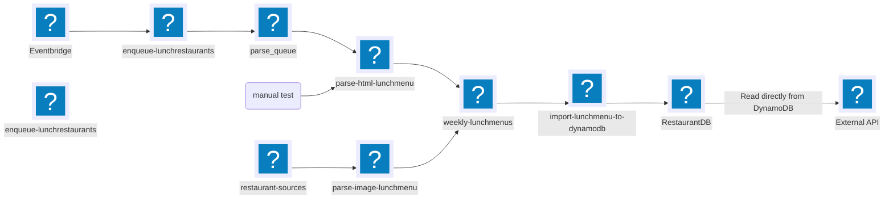

# Padev Lunch
This project is for using AI to scrape the webpages of lunch restaurants in Sweden. The backend is to be run on AWS, and the setup is to be done in CDK / CloudFormation. 

The infrastructure will consist of an API-Gateway, a DynamoDB table, two S3 buckets and a couple of Lambdas. 
It will also use SQS and eventbridge to kick off the parsing once a week. 

There will be a prod and a dev environment

All naming should follow: ```{app}-{env}-{component}```

## Architecture


## Resource Names
**Buckets:** 

* {app}-{env}-restaurant-sources
* {app}-{env}-weekly-lunchmenus

**Table:**

* {app}-{env}-lunchrestaurants

**Queue:**

* {app}-{env}-lunchmenu-parse-queue
* {app}-{env}-lunchmenu-parse-dlq

**Lambdas:**

* {app}-{env}-parse-html-lunchmenu
* {app}-{env}-parse-image-lunchmenu
* {app}-{env}-import-lunchmenu-to-dynamodb
* {app}-{env}-enqueue-lunchrestaurants

**EventBridge rule:**

* {app}-{env}-weekly-lunchmenu-ingest

**API:**

* {app}-{env}-api

## CDK / Cloudformation
Should be in typescript.

## S3
### S3 restaurant-sources
A collection of data about restaurants. To begin there will be lunch menus in PDF and image formats (PNG or JPG) uploaded when theres no HTML version.
The filestructure for this will be ```s3://{app}-{env}-restaurant-sources/menus/{restaurant_id}```


### S3 weekly-lunchmenus
This is where the parsed menus will be saved in CSV format.
the filestructure will be: ```s3://{app}-{env}-weekly-lunchmenus/weekly/year={year}/week={week}/{restaurant_id}.csv"```

## DynamoDB - lunchrestaurants
name: {app}-{env}-lunchrestaurants

PK : restaurant_id

SK: sk

In the beginning there will be two uses for the sortkey

### SK = "INFO": Information about a restaurant
Restaurant information
```
  {
    "restaurant_id": "",
    "sk": "INFO",
    "restaurant_name": "",
    "url": "",
    "city": "",
    "city_name": "",
    "area": "",
    "info": "",
    "lunch_hours": "",
    "address": "",
    "coordinates": "",
    "phone": ""
   }
```

````
{
  "restaurant_id": {
    "S": "goldendays"
  },
  "sk": {
    "S": "INFO"
  },
  "address": {
    "S": ""
  },
  "area": {
    "S": "innerstaden"
  },
  "city": {
    "S": "goteborg"
  },
  "info": {
    "S": "TILL LUNCHEN INGÅR EN FRÄSCH SALLADSBUFFÉ, NYBRYGGT KAFFE OCH KAKA"
  },
  "lunch_hours": {
    "S": "11.00-15.00"
  },
  "phone": {
    "S": ""
  },
  "restaurant_name": {
    "S": "Golden Days"
  },
  "url": {
    "S": "https://www.goldendays.se/"
  },
  "city_name": {
    "S": "Göteborg"
  }
}
````

### SK = MENU#{week}#{day}
```
  {
    "restaurant_id": "",
    "sk": MENU#{week}#{day},
    "city": "",
    "area": "",
    "week": "2026_03",
    "day": "mon",
    "dishes": [
      {"name":"Fiskgryta","price":135,"tags":["fish","glutenfree"]},
      {"name":"Vegetarisk lasagne","price":125,"tags":["veg","pasta"]}
    ] 
   }
```

```
{
 "restaurant_id": {
  "S": "goldendays"
 },
 "sk": {
  "S": "MENU#2026_03#mon"
 },
 "city": {
  "S": "goteborg"
 },
 "week": {
  "S": "2026_03"
 },
 "area": {
  "S": "innerstaden"
 },
 "day": {
  "S": "mon"
 },
 "dishes": {
  "L": [
   {
    "M": {
     "name": {
      "S": "Fiskgryta"
     },
     "price": {
      "S": "145"
     },
     "tags": {
      "L": [
       {
        "S": "fish"
       },
       {
        "S": "glutenfree"
       }
      ]
     }
    }
   }
  ]
 }
}
````

* week is in the format: YYYY_WW, (2026_04)

### GSI - Global Secondary Index: 
name. by_location_and_day
We are using the new functionality with multi attribute keys.
DynomoDB has a new functionality with multi atributes: https://docs.aws.amazon.com/amazondynamodb/latest/developerguide/GSI.DesignPattern.MultiAttributeKeys.html

partition key: 

1. city

sort key: 

1. week
2. day
3. restaurant_id

## Lambdas
The two main lambdas will be for parsing the lunch information. One for parsing HTML content and one for getting information from menus in PDF or image format (JPG/PNG)

All lambdas should be in Python

### Lambda parse-html-lunchmenu
This lambda will listen to an SQS queue. The event message should have the following structure. 

```
{
  "restaurant_url": "https://www.bjorkmansskafferi.se/",
  "restaurant_id": "bjorkmansskafferi",
  "city": "Göteborg",
  "area": "Avenyn"
}
```
restaurant_url and restaurant_id are mandatory, the rest are optional.

When there's a message the lambda will use the URL to get the HTML content. Send the content to ChatGPT API and ask for the lunch menu in CSV format.

**ChatGPT Parsing**

Both this and parse-image-lunchmenu would preferably use the same component for connecting to ChatGPT. We will test which model that works best. But start with gpt-5-nano. The only difference should be if HTML or PDF/Image are uploaded.

the CSV structure returned from ChatGPT should be:
```
day,lunch,price,tags
mon,"Marinerad kycklingfilé med kokosris, gochuangdressing, het syrad gurka med salladskål och morot toppas med sesamfrön och koriander",149,asiatiskt | kyckling
mon,"Pocherad dagens fångst med dillslungad potatis, vitvinsås med sidfläsk och svampragu, zucchini- och purjolöks crudité toppas med dill",149,fisk | svenskt
tue,"Friterad tofu med kokosris, gochuangdressing, het syrad gurka med salladskål och morot toppas med sesamfrön och koriander",149,asiatiskt | vegetariskt
tue,"Grekiska biffar med rostad kulpotatis, gräddig tomatsås, fetaost, oliver och ruccola",149,grekiskt | kött
```

max_tokens should be 2000 to start. But it would be good if we could have it as a variable for specific restaurants where we know the response could be long. This can be hardcoded to begin with for specific restaurant_id. 


**Manual test**

Apart from SQS trigger, this function should be able to be triggered by a manual test from the Lambda config in AWS. Same JSON as in the SQS message..

```
{
  "restaurant_url": "https://www.bjorkmansskafferi.se/",
  "restaurant_id": "bjorkmansskafferi",
  "city": "Göteborg",
  "area": "Avenyn"
}
```

### Lambda parse-image-lunchmenu
Listens to an S3 (restaurant data) where PDFs or images of menus are uploaded. The S3 folder structure is
```s3://{app}-{env}-restaurant-sources/menus/{restaurant_id}```

The PDF or Image is sent directly to ChatGPT for transcribing and formatting to correct CSV. CSV is saved to S3

**ChatGPT Parsing**

See section under 'parse-html-lunchmenu' for more information. 

But PDFs and images should be uploaded to ChatGPT as is. No effort to try and parse text from PDF or conversion of formats should be done to begin with.


**Triggers & Event Sources**

Trigger: s3:ObjectCreated:*


### Lambda import-lunchmenu-to-dynamodb
Listens to S3. When an item is uploaded to S3 it's read and saved in DynamoDB

### Lambda enqueue-lunchrestaurants

Triggered by eventbridge. Once a week, every Monday morning. Reads all restaurants INFO from the database. Adds the Restaurant URL and needed info to the SQS queue.

### SQS lunchmenu-parse-queue

#### SQS DLQ lunchmenu-parse-dlq

### Eventbridge weekly-lunchmenu-ingest
* Once a week

* Every Monday morning

### API Gateway
It's an external API intended for use by a webpage to show the lunches available.

There might be other external access later but nothing planned at the moment.

Throttling will be needed to limit abuse. We will begin with: 5 req/s steady, burst 20

### GET /restaurants/

### GET /restaurants/{restaurant_id}

### GET /restaurants/{restaurant_id}/{week}

### GET /lunch/{city}/{week}/{day}?area=
if area is undefined, "all" will be sent.
